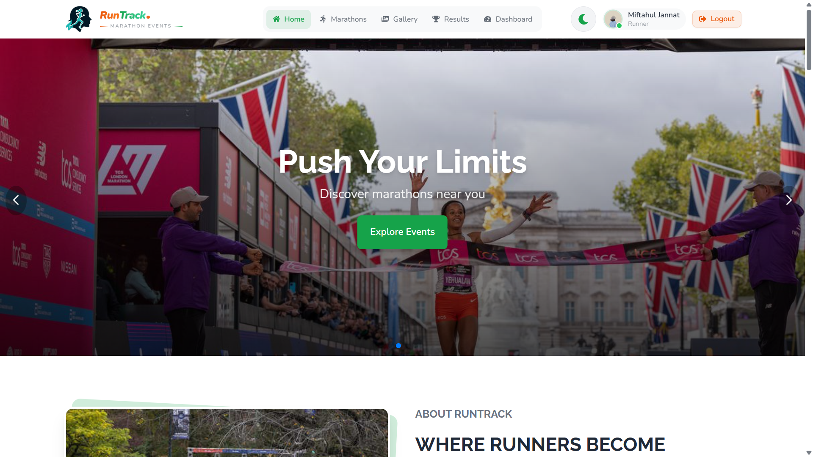
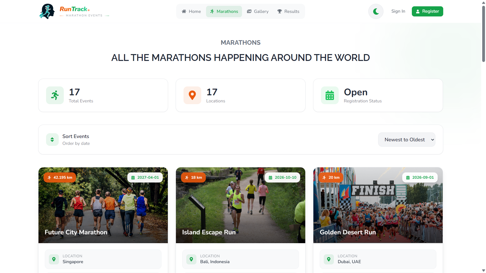
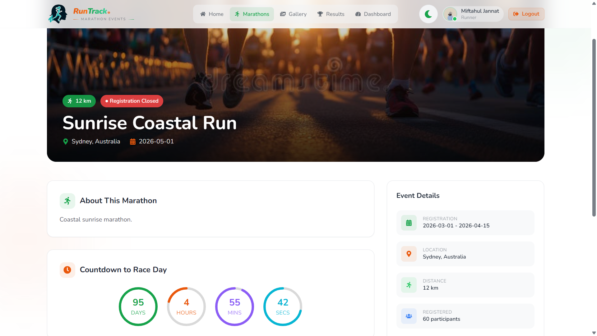
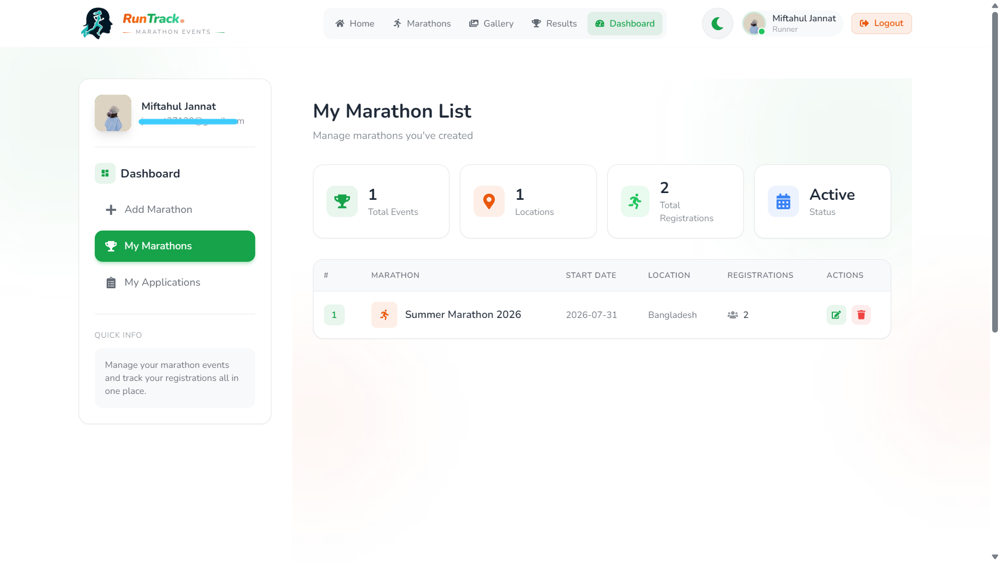

<div align="center">

# 🏃‍♂️ RunTrack

### Your Ultimate Marathon Event Platform

[](https://runtrack-marathon-event.web.app/)
[](https://firebase.google.com/)
[](https://reactjs.org/)
[](https://tailwindcss.com/)

**RunTrack** is a comprehensive platform designed to bring marathon enthusiasts together. Whether you're a seasoned runner or just starting your journey, RunTrack provides the best marathon experiences with seamless event management and registration.

[🌐 Visit Live Site](https://runtrack-marathon-event.web.app/) • [📖 Documentation](#table-of-contents) • [🐛 Report Bug](https://github.com/jannat-miftahul/marathon-event-ui/issues) • [✨ Request Feature](https://github.com/jannat-miftahul/marathon-event-ui/issues)

</div>

---

## 📋 Table of Contents

- [Key Features](#-key-features)
- [Demo](#-demo)
- [Tech Stack](#-tech-stack)
- [Project Structure](#-project-structure)
- [Getting Started](#-getting-started)
    - [Prerequisites](#prerequisites)
    - [Installation](#installation)
    - [Environment Variables](#environment-variables)
    - [Available Scripts](#available-scripts)
- [Usage](#-usage)
- [Contributing](#-contributing)
- [License](#-license)
- [Contact](#-contact)
- [Acknowledgments](#-acknowledgments)

---

## ✨ Key Features

- **Event Discovery** - Browse marathons worldwide with detailed information
- **Easy Registration** - Quick and secure event registration
- **User Dashboard** - Manage applications and track event status
- **Modern UI** - Beautiful, responsive design with Tailwind CSS
- **Secure Auth** - Firebase authentication with JWT-secured backend API
- **Fast Performance** - Built with Vite and React for optimal speed

---

## 🎬 Demo

### 🌐 Live Site

Visit the live application: **[RunTrack](https://runtrack-marathon-event.web.app/)**

### 📸 Screenshots

#### Homepage



#### Marathon Events



#### Event Details



#### User Dashboard



---

## 🛠️ Tech Stack

### Frontend

- **React** - UI library
- **React Router DOM** - Routing
- **Tailwind CSS + DaisyUI** - Styling & Components
- **Vite** - Build tool
- **Axios** - HTTP client

### Backend

- **Node.js** - Runtime environment
- **Express.js** - Web framework
- **MongoDB** - Database (MongoDB Atlas)
- **JWT** - Authentication

### Additional Libraries

- **Firebase** - Authentication & Hosting
- **React Icons** - Icon library
- **Lottie React** - Animations
- **React Hot Toast** - Notifications
- **SweetAlert2** - Alert dialogs
- **Swiper** - Image carousels
- **React DatePicker** - Date selection
- **React Countdown Timer** - Event countdowns

---

## 📁 Project Structure

```
marathon-event-ui/
├── src/
│   ├── components/        # Reusable components
│   ├── pages/             # Page components
│   ├── hooks/             # Custom React hooks
│   ├── context/           # State management
│   ├── routes/            # Route configuration
│   ├── firebase/          # Firebase config
│   └── assets/            # Static assets
├── package.json           # Dependencies
├── vite.config.js         # Vite config
└── tailwind.config.js     # Tailwind config
```

---

## 🚀 Getting Started

### Prerequisites

Before you begin, ensure you have the following installed:

- **Node.js** (version 16.x or higher) - [Download](https://nodejs.org/)
- **npm** (comes with Node.js) or **yarn**
- **Git** - [Download](https://git-scm.com/)

### Installation

Follow these steps to set up the project locally:

1. **Clone the repository**

    ```bash
    git clone https://github.com/yourusername/marathon-event-ui.git
    ```

2. **Navigate to the project directory**

    ```bash
    cd marathon-event-ui
    ```

3. **Install dependencies**

    ```bash
    npm install
    # or
    yarn install
    ```

4. **Set up environment variables**

    Create a `.env.local` file in the root directory and add your Firebase configuration:

    ```env
    VITE_FIREBASE_API_KEY=your_api_key_here
    VITE_FIREBASE_AUTH_DOMAIN=your_auth_domain_here
    VITE_FIREBASE_PROJECT_ID=your_project_id_here
    VITE_FIREBASE_STORAGE_BUCKET=your_storage_bucket_here
    VITE_FIREBASE_MESSAGING_SENDER_ID=your_messaging_sender_id_here
    VITE_FIREBASE_APP_ID=your_app_id_here
    ```

5. **Start the development server**

    ```bash
    npm run dev
    # or
    yarn dev
    ```

6. **Open your browser**

    Navigate to `http://localhost:5173` (or the port shown in your terminal)

### Environment Variables

To run this project, you will need to add the following environment variables to your `.env.local` file:

| Variable                            | Description                       |
| ----------------------------------- | --------------------------------- |
| `VITE_FIREBASE_API_KEY`             | Your Firebase API key             |
| `VITE_FIREBASE_AUTH_DOMAIN`         | Your Firebase auth domain         |
| `VITE_FIREBASE_PROJECT_ID`          | Your Firebase project ID          |
| `VITE_FIREBASE_STORAGE_BUCKET`      | Your Firebase storage bucket      |
| `VITE_FIREBASE_MESSAGING_SENDER_ID` | Your Firebase messaging sender ID |
| `VITE_FIREBASE_APP_ID`              | Your Firebase app ID              |

> **Note**: Never commit your `.env.local` file to version control. It's already included in `.gitignore`.

### Available Scripts

In the project directory, you can run:

| Command           | Description                                                 |
| ----------------- | ----------------------------------------------------------- |
| `npm run dev`     | Runs the app in development mode at `http://localhost:5173` |
| `npm run build`   | Builds the app for production to the `dist` folder          |
| `npm run preview` | Preview the production build locally                        |
| `npm run lint`    | Runs ESLint to check code quality                           |

---

## 💡 Usage

### For Users

1. **Browse Events**: Visit the homepage to see upcoming marathon events
2. **Register**: Click on an event and fill out the registration form
3. **Manage Registrations**: Access your dashboard to view and manage your applications
4. **Stay Updated**: Receive notifications about your registered events

### For Developers

```javascript
// Example: Using the custom hooks
import { useAuth } from "./hooks/useAuth";

function MyComponent() {
    const { user, loading } = useAuth();

    if (loading) return <div>Loading...</div>;

    return <div>Welcome, {user?.displayName}!</div>;
}
```
